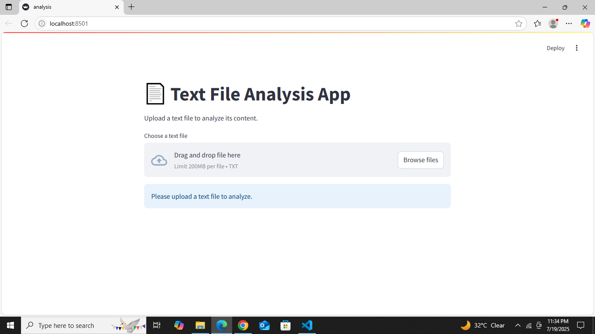
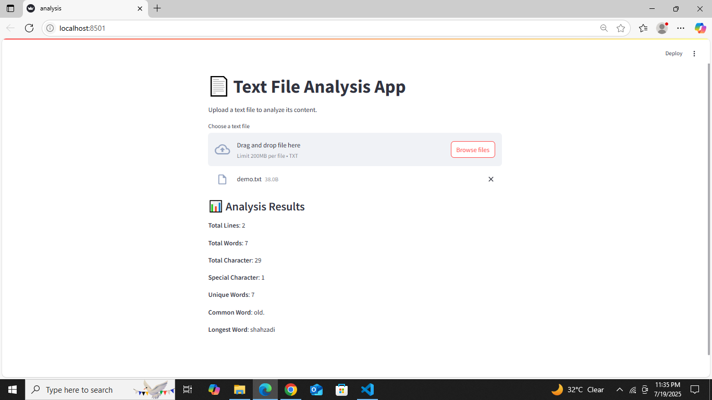

#  Text File Analyzer (Streamlit App)

This is a simple Streamlit web app that analyzes a `.txt` file. It provides:

- Total lines
- Total words
- Total characters
- Special characters
- Unique words
- Most common word
- Longest word

---

##  How to Run

1. Install Streamlit:

```bash
pip install streamlit
```

## Screenshots

###  Homepage

This screenshot shows the landing page of the Text File Analyzer app.



---

###  Analysis Results

This shows the output summary after uploading and analyzing a `.txt` file.


